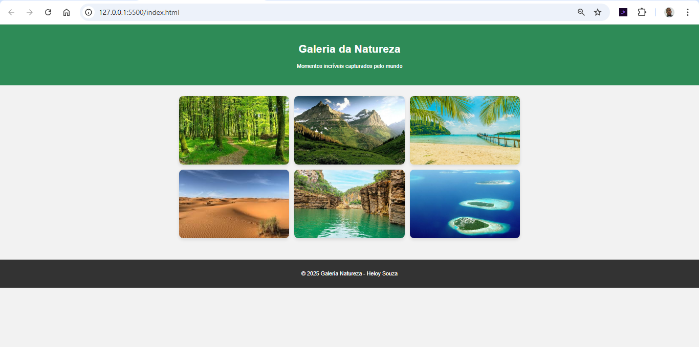

# Galeria de Fotos - Natureza

Projeto de página estática com **HTML5** e **CSS3** para exibir uma galeria de fotos de natureza, com imagens de paisagens, florestas e montanhas. O foco está em um layout responsivo, grid flexível e efeitos visuais.

## 🌍 Objetivo

Exibir fotos em uma galeria interativa com efeito de hover, usando um grid responsivo que adapta o número de colunas conforme o tamanho da tela. Este projeto foca em design visual e usabilidade.

## 🖼️ Preview



## 🚀 Tecnologias Utilizadas

- HTML5
- CSS3

## 💡 Funcionalidades

- Layout responsivo com grid flexível
- Efeito de zoom ao passar o mouse sobre as imagens
- Imagens com bordas arredondadas e sombra para dar profundidade
- Design limpo e fácil de navegar

## 📂 Estrutura de Arquivos

galeria-natureza/
├── index.html
├── style.css
└── images/
├── floresta.jpg
├── montanha.jpg
├── praia.jpg
├── deserto.jpg
└── lago.jpg


## ⚙️ Como Executar

1. Clone o repositório:
   ```bash
   git clone https://github.com/heloysouza/galeria-natureza.git
